# Hi there , I'm Jerico Oliver

<div align="center">
  
  [](https://portfolio-hjco.vercel.app)
  [](https://www.linkedin.com/in/hero-jerico-oliver-0a5113389/)
  [](mailto:oliverjerico97@gmail.com)
  
</div>

##  About Me

I'm a **freelance frontend developer** passionate about building clean, performant, and accessible web applications. I specialize in transforming designs into seamless user experiences with **React**, **JavaScript**, and modern web technologies.

```javascript
class JericoOliver extends FrontendDeveloper {
  
  name = "Hero Jerico Oliver";
  location = "Urdaneta City, Philippines 🇵🇭";
  title = "Frontend Developer";
  
  #projectsShipped = "15+";
  #coffeeConsumed = "∞";
  
  get currentFocus() {
    return "Crafting pixel-perfect, accessible web experiences that users love";
  }
  
  get techStack() {
    return {
      frontend: ["React", "JavaScript (ES6+)", "HTML5", "CSS3"],
      styling: ["Tailwind CSS", "Bootstrap", "SASS/SCSS"],
      tools: ["Git & GitHub", "VS Code", "Vite", "npm"],
      specialties: ["Responsive Design", "Web Accessibility (WCAG 2.1)", "Performance Optimization"]
    };
  }
  
  get currentlyLearning() {
    return ["Advanced React Patterns", "TypeScript", "Next.js", "Testing with Jest"];
  }
  
  get superpowers() {
    return [
      "🎨 Turning Figma designs into pixel-perfect reality",
      "⚡ Optimizing load times from 5s to <1s",
      "♿ Making the web accessible to everyone",
      "🐛 Debugging with Chrome DevTools like a detective"
    ];
  }
  
  get philosophy() {
    return "Great UX is invisible - users shouldn't notice it, they should just feel it works ✨";
  }
  
  collaborate() {
    return "Always open to interesting projects and learning opportunities! 🤝";
  }
  
  sayHi() {
    console.log("👋 Hey! Let's build something amazing together!");
  }
}

const dev = new JericoOliver();
dev.sayHi();
```

---

##  What I Do

<table>
<tr>
<td width="50%" valign="top">

### 🎨 Responsive Design
Building mobile-first, pixel-perfect interfaces that work flawlessly across all devices and screen sizes.

**Skills:**
- Mobile-First Approach
- Cross-Browser Compatibility
- Flexible Grid Systems
- Adaptive Images & Media


</td>
<td width="50%" valign="top">

### ⚡ Performance Optimization
Crafting lightning-fast experiences with optimized load times and smooth 60fps animations.

**Skills:**
- Code Splitting & Lazy Loading
- Asset Optimization
- Lighthouse Auditing
- Core Web Vitals


</td>
</tr>

<tr>
<td width="50%" valign="top">

### ♿ Web Accessibility
Creating WCAG 2.1 AA compliant applications that everyone can use, regardless of ability.

**Skills:**
- Semantic HTML Structure
- ARIA Labels & Roles
- Keyboard Navigation
- Screen Reader Testing


</td>
<td width="50%" valign="top">

### 🧩 Clean Code Practices
Writing maintainable, well-documented code following industry standards and best practices.

**Skills:**
- Component Architecture
- Code Documentation
- Git Workflow & Version Control
- Code Review & Refactoring


</td>
</tr>
</table>

---

### 💼 My Development Process

```mermaid
graph LR
    A[📋 Requirements] --> B[🎨 Design Review]
    B --> C[⚙️ Development]
    C --> D[🧪 Testing]
    D --> E[🚀 Deployment]
    E --> F[📊 Monitoring]
    F --> G[🔄 Iterate]
    style A fill:#6C5CE7,stroke:#fff,stroke-width:2px,color:#fff
    style B fill:#6C5CE7,stroke:#fff,stroke-width:2px,color:#fff
    style C fill:#6C5CE7,stroke:#fff,stroke-width:2px,color:#fff
    style D fill:#6C5CE7,stroke:#fff,stroke-width:2px,color:#fff
    style E fill:#6C5CE7,stroke:#fff,stroke-width:2px,color:#fff
    style F fill:#6C5CE7,stroke:#fff,stroke-width:2px,color:#fff
    style G fill:#6C5CE7,stroke:#fff,stroke-width:2px,color:#fff
```



---

##  Tech Stack

### Frontend Development


### Styling & Design


### Tools & Workflow


---

##  GitHub Stats

<div align="center">
  
  
  
  
  
  

</div>

---


##  What Drives Me

> "Great design is invisible. Great code is maintainable. Great UX is delightful."

I believe that the best web experiences are built at the intersection of:
- **Performance** - Fast load times and smooth interactions
- **Accessibility** - Inclusive design for everyone
- **Maintainability** - Clean code that scales
- **User Delight** - Thoughtful details that make users smile

---

##  Let's Connect!

I'm always open to interesting projects and collaborations. Whether you're looking to build something new or need help with an existing project, let's chat!

- 🌐 **Portfolio**: [portfolio-hjco.vercel.app](https://portfolio-hjco.vercel.app)
- 💼 **LinkedIn**: [Hero Jerico Oliver](https://www.linkedin.com/in/hero-jerico-oliver-0a5113389/)
- 📧 **Email**: oliverjerico97@gmail.com
- 📱 **Facebook**: [hero.oliver.1](https://www.facebook.com/hero.oliver.1/)

---

<div align="center">
  
  ###  "Code is like humor. When you have to explain it, it's bad."
  
  
  
  **Thanks for stopping by! Let's build something amazing together! 🚀**
  
</div>