# Hi there , I'm Jerico Oliver

<div align="center">
  
  [](https://portfolio-hjco.vercel.app)
  [](https://www.linkedin.com/in/hero-jerico-oliver-0a5113389/)
  [](mailto:oliverjerico97@gmail.com)
  
</div>

##  About Me

I'm a **freelance frontend developer** passionate about building clean, performant, and accessible web applications. I specialize in transforming designs into seamless user experiences with **React**, **JavaScript**, and modern web technologies.

```javascript
class JericoOliver extends FrontendDeveloper {
  name = "Hero Jerico Oliver";
  location = "Urdaneta City, Philippines 🇵🇭";
  title = "Frontend Developer";
  #projectsShipped = "15+";
  #coffeeConsumed = "∞";
  
  get currentFocus() {
    return "Crafting pixel-perfect, accessible web experiences that users love";
  }
  
  get techStack() {
    return {
      frontend: ["React", "JavaScript (ES6+)", "HTML5", "CSS3"],
      styling: ["Tailwind CSS", "Bootstrap", "SASS/SCSS"],
      tools: ["Git & GitHub", "VS Code", "Vite", "npm"],
      specialties: ["Responsive Design", "Web Accessibility (WCAG 2.1)", "Performance Optimization"]
    };
  }
  
  get currentlyLearning() {
    return ["Advanced React Patterns", "TypeScript", "Next.js", "Testing with Jest"];
  }
  
  get superpowers() {
    return ["🎨 Turning Figma designs into pixel-perfect reality", "⚡ Optimizing load times from 5s to <1s", 
            "♿ Making the web accessible to everyone", "🛠 Debugging with Chrome DevTools like a detective"];
  }
  
  get philosophy() {
    return "Great UX is invisible - users shouldn't notice it, they should just feel it works ✨";
  }
  
  collaborate() { return "Always open to interesting projects and learning opportunities! 🤝"; }
  
  sayHi() { console.log("👋 Hey! Let's build something amazing together!"); }
}

const dev = new JericoOliver();
dev.sayHi();
```

---

##  What I Do

<table>
<tr>
<td width="50%" valign="top">

### 🎨 Responsive Design
Building mobile-first, pixel-perfect interfaces that work flawlessly across all devices and screen sizes.

**Skills:**
- Mobile-First Approach
- Cross-Browser Compatibility
- Flexible Grid Systems
- Adaptive Images & Media


</td>
<td width="50%" valign="top">

### ⚡ Performance Optimization
Crafting lightning-fast experiences with optimized load times and smooth 60fps animations.

**Skills:**
- Code Splitting & Lazy Loading
- Asset Optimization
- Lighthouse Auditing
- Core Web Vitals


</td>
</tr>

<tr>
<td width="50%" valign="top">

### ♿ Web Accessibility
Creating WCAG 2.1 AA compliant applications that everyone can use, regardless of ability.

**Skills:**
- Semantic HTML Structure
- ARIA Labels & Roles
- Keyboard Navigation
- Screen Reader Testing


</td>
<td width="50%" valign="top">

### 🧩 Clean Code Practices
Writing maintainable, well-documented code following industry standards and best practices.

**Skills:**
- Component Architecture
- Code Documentation
- Git Workflow & Version Control
- Code Review & Refactoring


</td>
</tr>
</table>

---

### 💼 My Development Process

```mermaid
graph LR
    A[📋 Requirements] --> B[🎨 Design Review]
    B --> C[⚙️ Development]
    C --> D[🧪 Testing]
    D --> E[🚀 Deployment]
    E --> F[📊 Monitoring]
    F --> G[🔄 Iterate]
    style A fill:#6C5CE7,stroke:#fff,stroke-width:2px,color:#fff
    style B fill:#6C5CE7,stroke:#fff,stroke-width:2px,color:#fff
    style C fill:#6C5CE7,stroke:#fff,stroke-width:2px,color:#fff
    style D fill:#6C5CE7,stroke:#fff,stroke-width:2px,color:#fff
    style E fill:#6C5CE7,stroke:#fff,stroke-width:2px,color:#fff
    style F fill:#6C5CE7,stroke:#fff,stroke-width:2px,color:#fff
    style G fill:#6C5CE7,stroke:#fff,stroke-width:2px,color:#fff
```



---

##  Tech Stack & Tools

<div align="center">

### 💻 Technologies I Work With Daily

</div>

<table>
<tr>
<td align="center" width="33%" valign="top">

### 🎨 Frontend Development

<p align="center">
  
  
  
  
  
</p>

**Specializing in:**
- Modern React (Hooks, Context)
- ES6+ JavaScript
- Semantic HTML
- Responsive Layouts

</td>
<td align="center" width="33%" valign="top">

### 🎨 Styling & Design

<p align="center">
  
  
  
  
  
</p>

**Specializing in:**
- Utility-First CSS
- Design Systems
- Mobile-First Design
- Component Libraries

</td>
<td align="center" width="33%" valign="top">

### 🛠️ Tools & Workflow

<p align="center">
  
  
  
  
  
</p>

**Specializing in:**
- Version Control
- Modern Build Tools
- Package Management
- Developer Experience

</td>
</tr>
</table>

<br/>

<div align="center">

### 🌱 Currently Exploring


</div>

---


##  GitHub Stats & Activity

<div align="center">

### 📊 My Coding Journey in Numbers

<br/>

<table>
<tr>
<td width="50%" align="center">
  
  
  
</td>
<td width="50%" align="center">
  
  
  
</td>
</tr>
</table>

<br/>


<br/><br/>

### 🏆 GitHub Trophies


<br/>

### 📈 Contribution Graph


<br/>

### 💡 Quick Stats


<br/>


</div>

---

##  What Drives Me

<div align="center">

### *"Great design is invisible. Great code is maintainable. Great UX is delightful."*

</div>

<br/>

<table>
<tr>
<td align="center" width="25%">

<h3>⚡ Performance</h3>
<p>Fast load times and smooth interactions that keep users engaged</p>
</td>
<td align="center" width="25%">

<h3>♿ Accessibility</h3>
<p>Inclusive design that works for everyone, regardless of ability</p>
</td>
<td align="center" width="25%">

<h3>🧩 Maintainability</h3>
<p>Clean, documented code that scales with your project</p>
</td>
<td align="center" width="25%">

<h3>✨ User Delight</h3>
<p>Thoughtful details and micro-interactions that make users smile</p>
</td>
</tr>
</table>

<br/>

<div align="center">

### 🎯 My Mission

Building web experiences at the intersection of **beauty**, **speed**, and **inclusivity** — where every user feels valued and every interaction feels natural.

</div>

---

##  Let's Connect!

<div align="center">

### 💼 Open for Freelance Projects | Available Starting January 2025

I'm always excited to collaborate on interesting projects! Whether you need a **responsive website**, **React application**, or help **optimizing your existing frontend**, let's chat.

<br/>

<table>
<tr>
<td align="center" width="25%">
<a href="https://portfolio-hjco.vercel.app">

<br/><b>Portfolio</b>
<br/>View My Work
</a>
</td>
<td align="center" width="25%">
<a href="https://www.linkedin.com/in/hero-jerico-oliver-0a5113389/">

<br/><b>LinkedIn</b>
<br/>Let's Network
</a>
</td>
<td align="center" width="25%">
<a href="mailto:oliverjerico97@gmail.com">

<br/><b>Email</b>
<br/>Send a Message
</a>
</td>
<td align="center" width="25%">
<a href="https://www.facebook.com/hero.oliver.1/">

<br/><b>Facebook</b>
<br/>Stay Connected
</a>
</td>
</tr>
</table>

<br/>

### 🚀 Looking For:
**React Development** • **UI/UX Implementation** • **Frontend Optimization** • **Website Development**

<br/>

### ⚡ Quick Response Time | 🌏 Remote Friendly | 💬 English & Filipino

</div>

---

<div align="center">
  
  ###  "Code is like humor. When you have to explain it, it's bad."
  
  
  
  **Thanks for stopping by! Let's build something amazing together! 🚀**
  
</div>